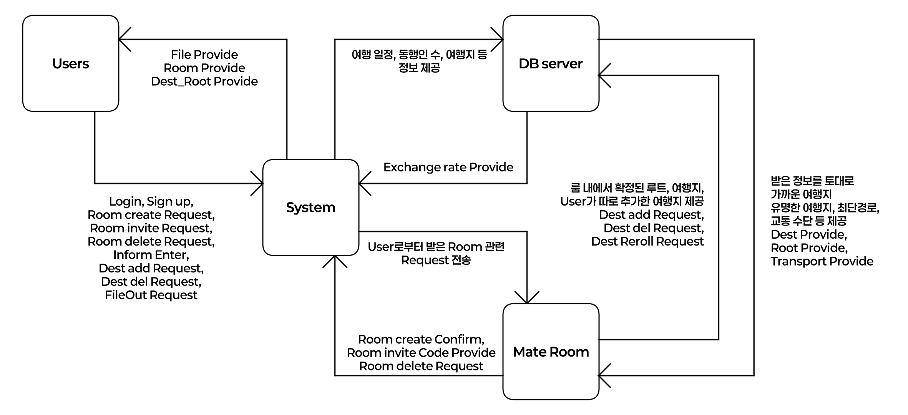

Analysis
=============
Logo // 추후 수정
###### 22311955, 최지은, <serp12310229@gmail.com>
***
### Revision history
```08/05/2026 | ver.0.1 | Analysis Document```

***

### Contents
1. Business purpose
2. Use case analysis
3. Use case description
4. Glossary
5. References

***

## Business purpose
**1) Project background**

사람이 살아가는 데에 있어 휴식은 무엇보다 중요하다. 그리고 휴식의 방법으로 자주 거론되는 것이 바로 여행이다. 그러나 현실적인 이유(금전, 시간 등)로 인해 여행 약속을 잡았다가도 취소되는 경우는 주변에서도 매우 빈번하다.
그 중에서, 특히 다인 약속에서 여행이 취소되는 가장 큰 이유 중 하나가 바로 여행 일정 계획의 어려움과 계획의 미이행, 예약 실패 및 여행지와 관한 의견 충돌이다.
여행 약속에서 계획을 짜고 동선을 계산하고, 예약을 도맡아 진행하는 사람이 받는 스트레스는 상당히 크다. 국내 여행에서도 그러하지만 해외 여행의 경우는 언어의 제약과 익숙하지 않은 지리 및 문화의 충돌, 사기에 대한 불안함 등으로 인해 불편함을 호소하는 사람이 더욱 많다.
즉, 쉬기 위해서 여행을 가는데 역으로 여행 그 자체가 스트레스를 유발하는 원인이 되는 사태가 발생하게 된다는 것이다. 개인적으로도 이런 식으로 여행이 취소되거나 심하게는 함께 여행을 가기로 했던 친구와 연을 끊는 일까지 생겨, 여행을 가는 것 자체를 피곤하게 여기던 시절이 있었다.

그렇게 여행 약속을 잡을 때마다 늘 '아, 누군가가 나 대신 여행 일정을 좀 짜주면 좋겠다'라는 생각을 하는 지경까지 이르렀고, 결국은 그 '누군가'를 스스로 만들어보아야겠다고 다짐하게 되었다. 여행의 피로도 중 상당수를 차지하는 계획 부분을 직접 할 수고를 덜게 된다면 더욱 쾌적하고 편안한 여행이 될 수 있을 것이란 확신이 들었기 때문이다.
'누군가'는 나와 같은, 혹은 어딘가의 여느 여행자와 같은 존재라는 의미에서 'Traveler'의 일부를 따 'Aveler' 에블러라 이름 지었다. 계획이 두려워 여행을 시도하지 못한 사람들에게 용기를 주고 싶어, 캐치프레이즈는 'Try, Aveler'로 하기로 하였다.

Aveler를 어플리케이션으로 구현하는 것은 휴대폰이 곧 지도이자 번역기이자 지갑인 현대 사회에서 확실히 직관적이지만, Aveler는 '여행 친구'가 아니라 '나 대신 계획을 짜줄 누군가'이기 때문에 집에서 계획하는 것을 기본 전제로 두어 홈페이지로 구현하고자 한다.
금전 계산이 필수적인 여행 계획에 있어 휴대폰과 데스크탑을 번갈아 이용해야 하는 상황이 생긴다면 손이 잘 가지 않을 듯 하여 이렇게 결정하였다. UI와 입력은 눈에 잘 들어오게끔 구상하고, 편한 서칭과 지도 저장을 위해 Google 계정을 연동하여 로그인하는 기능을 만든다면 더욱 좋을 것이다.
여러 명이 함께 이용하는 경우를 상정하여 친구를 초대해 함께 여행 일정을 구상하는 Mate Room을 만들고, 그 Room 안에서 여행지와 호텔, 이동 동선과 이용해야 하는 교통 수단 등을 눈에 잘 들어오는 색으로 표시하여 직관적으로 계획을 확인할 수 있게끔 한다.
또한, 그렇게 만들어진 여행 계획표를 언제 어디서든 확인할 수 있도록 pdf, jpg 파일 혹은 excel 파일로 변환하여 내보내는 기능을 포함한다.

Aveler는 어딘가의 여행자이며, 우리는 그가 만든 길을 따라 걸으며 즐기는 또 다른 여행자가 될 것이다.

**2) Goal**

- 여행지, 예산, 동행인원, 여행 스타일 등의 정보를 입력하면 그에 따른 알맞은 여행지와 이동 동선, 교통 수단을 제공한다.
  - 국가를 설정하면 환율을 제공하여 금전 계산을 더욱 편하게 한다.
- 친구들과 동시 접속하여 계획을 함께 수정해나갈 수 있게끔 하는 멀티 시스템을 제공한다.
- 만들어진 여행 일정을 여러 포맷의 파일로 내보내는 기능을 제공한다.

**3) Traget Market**

여행 계획을 짜는 것을 피곤하게 생각하는 사람, 머리는 편하게 몸은 즐겁게 노는 여행을 원하는 사람, 해외 여행이 무서워서 시도하지 못하고 있던 사람

***

## Use case diagram

이 프로젝트를 위해 작성한 diagram은 위와 같다. 회원 정보 및 여행지를 저장하기 위한 DB 서버로 웹호스팅을 이용할 것이다.

***

## Use case description
-

***

## Glossary
해당 파일에 사용된 용어들을 설명한다.
- Aveler: 이 프로젝트로 만들어지는 서비스의 이름이다.
- Mate Room: 여행 일정이 저장되는 일종의 file이다.
- DB server: 회원 정보, Mate Room의 정보가 저장되는 서버이다.
- Dest: 여행지에 있는 여행 장소이다.
- Root: 여행 장소들을 잇는 최단(혹은 최적의) 루트이다.
- Transport: 여행지에서 사용될 수 있는 교통 수단이다.
- imform: 유저가 DB server와 Mate Room에 제공하는 기본 정보이다.
  - 여행지, 여행 일자, 동행인 수, 선호 교통 수단, 여행 스타일, 예산을 포함한다.

***

## References
호주 여행지 추천 사이트: Tourism Australia <https://www.australia.com>

한국관광공사 주관 대한민국 여행 사이트: 대한민국 구석구석 <https://korean.visitkorea.or.kr> - 중 AI콕콕 플래너

