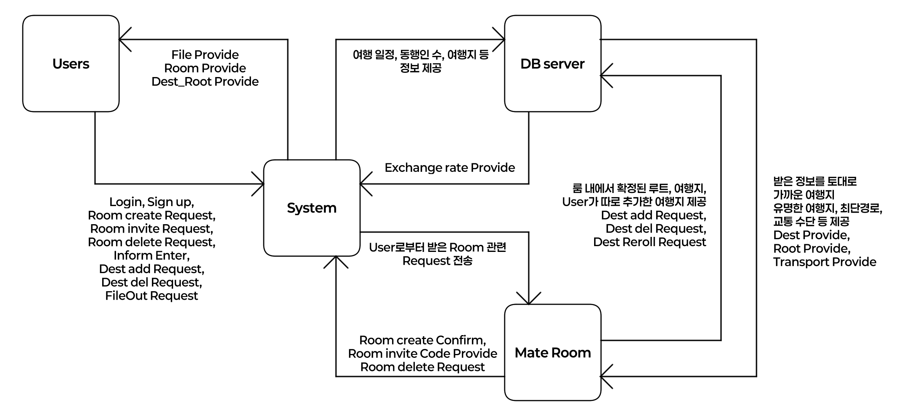

Conceptualization
=============
Logo // 추후 수정
###### 22311955, 최지은, <serp12310229@gmail.com>
***
### Revision history
```27/03/2026 | ver.0.1 | Conceptualization Document```

***

### Contents
1. Business purpose
2. System context diagram
3. Use case list
4. Concept of operation
5. Problem statement
6. Glossary
7. References

***

## Business purpose
**1) Project background**

사람이 살아가는 데에 있어 휴식은 무엇보다 중요하다. 그리고 휴식의 방법으로 자주 거론되는 것이 바로 여행이다. 그러나 현실적인 이유(금전, 시간 등)로 인해 여행 약속을 잡았다가도 취소되는 경우는 주변에서도 매우 빈번하다.
그 중에서, 특히 다인 약속에서 여행이 취소되는 가장 큰 이유 중 하나가 바로 여행 일정 계획의 어려움과 계획의 미이행, 예약 실패 및 여행지와 관한 의견 충돌이다.
여행 약속에서 계획을 짜고 동선을 계산하고, 예약을 도맡아 진행하는 사람이 받는 스트레스는 상당히 크다. 국내 여행에서도 그러하지만 해외 여행의 경우는 언어의 제약과 익숙하지 않은 지리 및 문화의 충돌, 사기에 대한 불안함 등으로 인해 불편함을 호소하는 사람이 더욱 많다.
즉, 쉬기 위해서 여행을 가는데 역으로 여행 그 자체가 스트레스를 유발하는 원인이 되는 사태가 발생하게 된다는 것이다. 개인적으로도 이런 식으로 여행이 취소되거나 심하게는 함께 여행을 가기로 했던 친구와 연을 끊는 일까지 생겨, 여행을 가는 것 자체를 피곤하게 여기던 시절이 있었다.

그렇게 여행 약속을 잡을 때마다 늘 '아, 누군가가 나 대신 여행 일정을 좀 짜주면 좋겠다'라는 생각을 하는 지경까지 이르렀고, 결국은 그 '누군가'를 스스로 만들어보아야겠다고 다짐하게 되었다. 여행의 피로도 중 상당수를 차지하는 계획 부분을 직접 할 수고를 덜게 된다면 더욱 쾌적하고 편안한 여행이 될 수 있을 것이란 확신이 들었기 때문이다.
'누군가'는 나와 같은, 혹은 어딘가의 여느 여행자와 같은 존재라는 의미에서 'Traveler'의 일부를 따 'Aveler' 에블러라 이름 지었다. 계획이 두려워 여행을 시도하지 못한 사람들에게 용기를 주고 싶어, 캐치프레이즈는 'Try, Aveler'로 하기로 하였다.

Aveler를 어플리케이션으로 구현하는 것은 휴대폰이 곧 지도이자 번역기이자 지갑인 현대 사회에서 확실히 직관적이지만, Aveler는 '여행 친구'가 아니라 '나 대신 계획을 짜줄 누군가'이기 때문에 집에서 계획하는 것을 기본 전제로 두어 홈페이지로 구현하고자 한다.
금전 계산이 필수적인 여행 계획에 있어 휴대폰과 데스크탑을 번갈아 이용해야 하는 상황이 생긴다면 손이 잘 가지 않을 듯 하여 이렇게 결정하였다. UI와 입력은 눈에 잘 들어오게끔 구상하고, 편한 서칭과 지도 저장을 위해 Google 계정을 연동하여 로그인하는 기능을 만든다면 더욱 좋을 것이다.
여러 명이 함께 이용하는 경우를 상정하여 친구를 초대해 함께 여행 일정을 구상하는 Mate Room을 만들고, 그 Room 안에서 여행지와 호텔, 이동 동선과 이용해야 하는 교통 수단 등을 눈에 잘 들어오는 색으로 표시하여 직관적으로 계획을 확인할 수 있게끔 한다.
또한, 그렇게 만들어진 여행 계획표를 언제 어디서든 확인할 수 있도록 pdf, jpg 파일 혹은 excel 파일로 변환하여 내보내는 기능을 포함한다.

Aveler는 어딘가의 여행자이며, 우리는 그가 만든 길을 따라 걸으며 즐기는 또 다른 여행자가 될 것이다.

**2) Goal**

- 여행지, 예산, 동행인원, 여행 스타일 등의 정보를 입력하면 그에 따른 알맞은 여행지와 이동 동선, 교통 수단을 제공한다.
  - 국가를 설정하면 환율을 제공하여 금전 계산을 더욱 편하게 한다.
- 친구들과 동시 접속하여 계획을 함께 수정해나갈 수 있게끔 하는 멀티 시스템을 제공한다.
- 만들어진 여행 일정을 여러 포맷의 파일로 내보내는 기능을 제공한다.

**3) Traget Market**

여행 계획을 짜는 것을 피곤하게 생각하는 사람, 머리는 편하게 몸은 즐겁게 노는 여행을 원하는 사람, 해외 여행이 무서워서 시도하지 못하고 있던 사람

***

## System context diagram

이 프로젝트를 위해 작성한 diagram은 위와 같다. 회원 정보 및 여행지를 저장하기 위한 DB 서버로 웹호스팅을 이용할 것이다.

***

## Use case list
이 프로젝트에서 발생할 수 있는 use case는 다음과 같다. 유사한 기능을 제공하거나 함께 제공되는 기능들은 묶어서 서술하였다.
- 회원 가입
  - Actor: Users
  - Description: 기능을 이용하고 계획된 여행 일정을 확인하기 위해 회원으로 등록한다.
- 로그인
  - Actor: Users
  - Description: 기능을 이용하고 계획된 여행 일정을 확인하기 위해 회원 로그인한다. User가 아이디, 비밀번호를 주며 Request하면 System은 DB server에 정보를 넘겨주고 정보를 받아 최종적으로 User에게 넘겨준다.
- Room create/invite/delete/Provide
  - Actor: Users, Mate Room
  - Description: 각 여행 일정을 저장하는 Room을 생성하고, 다른 회원을 초대하고, Room을 삭제한다. Room의 정보는 DB server에 즉각 업로드된다. 생성된 Room은 Login 시 Room Provide를 통해 user에게 전달된다.
- Inform Enter
  - Actor: Users
  - Description: 여행지, 여행 인원, 선호 교통 수단, 여행 스타일을 입력하여 DB server에 전달한다.
- Dest add/del Request
  - Actor: Users
  - Description: 여행 중 가고 싶은 여행지를 추가/제거한다. 정보는 Mate Room에 전달된다.
- File Out Request
  - Actor: Users
  - Description: 생성된 여행 계획을 pdf, jpg 등의 파일로 변환하여 다운로드할 때 Mate Room에 전달된다. Mate Room은 정보를 변환하여 User에게 전달한다.
- Dest/Root/Transport Provide
  - Actor: Mate Room
  - Description: 여행지, 이동 루트, 교통 수단 등의 정보를 찾아 user에게 전달한다.
- Room inform Request/Provide
  - Actor: Mate Room
  - Description: Room의 정보를 DB server에 요청하고, DB server로부터 정보를 받는다.
***
## Concept of operation
use case의 작동에 관한 것을 기술한다. 유사한 기능을 제공하거나 함께 제공되는 기능들은 묶어서 서술하였다.
- 회원 가입
  - Purpose: Room 생성/가입 등의 action을 할 때 회원 정보(사용자 ID)가 있어야 한다.
  - Approach: ID가 없을 시 회원 가입을 제공한다.
  - Dynamics: Room 생성/가입을 할 경우, 여행지를 입력하고 여행지 추천을 받으려 할 경우
  - Goals: 회원 가입 기능을 구현한다.
- 로그인
  - Purpose: Room 생성/가입 등의 action을 할 때 회원 정보(사용자 ID)가 있어야 한다.
  - Approach: 기능을 수행하기 위해 로그인할 수 있게 한다.
  - Dynamics: Room 생성/가입을 할 경우, 여행지를 입력하고 여행지 추천을 받으려 할 경우
  - Goals: 로그인 기능을 구현한다.
- Room create/invite/delete/Provide
  - Purpose: 사용자가 여행 일정을 원활히 만들 수 있게 하기 위해, Room을 보여준다.
  - Approach: 로그인 시, 현재 Room이 있을 경우 목록과 생성/가입/삭제를 제공하고, 없을 경우 생성/가입 기능을 제공한다.
  - Dynamics: 로그인에 성공했을 경우, 여행 계획을 짜려고 할 경우
  - Goals: Room 제목과 여행지, 여행 일자, 인원 수를 포함한 Room의 정보를 리스트 형태로 나열한다.
- Inform Enter
  - Purpose: Room을 만들 때 정보를 명확하게 파악하기 위하여 기본 정보를 Room과 DB에 제공한다.
  - Approach: Room 생성 시, 여행지, 여행 일자, 동행인 수, 선호 교통 수단, 여행 스타일, 예산을 작성하여 Room과 DB server에 전달한다.
  - Dynamics: Room을 만들고자 할 경우
  - Goals: Room과 DB server에 상기한 정보를 저장한다.
- Dest add/del Request
  - Purpose: Aveler가 제공하는 것 이외의, 혹은 제공된 여행지 중 임의의 것을 추가/삭제한다.
  - Approach: UI에서 추가 버튼을 누를 경우, 여행지를 클릭할 경우 추가/삭제 기능이 제공된다.
  - Dynamics: 여행지를 추가하거나 삭제하고 싶을 경우
  - Goals: 여행지의 추가/삭제 기능을 제공하고, 추가/삭제된 여행지를 DB server에 업데이트한다.
- File Out Request
  - Purpose: 확정된 여행 일정을 휴대전화 등으로 갖고 다니기 편하게끔 file을 제공한다.
  - Approach: UI에서 다운로드 버튼을 누를 경우, 혹은 Room 목록 화면에서 해당 Room을 선택했을 경우 타 기능과 함께 file 변환 기능이 제공된다.
  - Dynamics: 여행 계획표를 다운로드 받고 싶을 경우
  - Goals: 지도 형태, 리스트 형태(타임 테이블)로 정리된 여행 일정 file을 pdf, jpg, excel 등의 파일로 변환하여 제공한다.
- Dest/Root/Transport Provide
  - Purpose: 유저가 Inform Enter를 통해 전달한 정보를 바탕으로, 주변의 여행지/여행 루트/이용 가능한 교통 수단을 제공한다.
  - Approach: Room이 생성될 때 처음 제공되고, 동일한 Room에서 다른 일정을 짤 때에도 제공된다. (Folder와 유사하다. 1안의 여행지, 2안의 여행지 등등 세분화 할 수 있게끔 한다.)
  - Dynamics: Aveler가 추천하는 여행 계획을 받고 싶을 경우
  - Goals: 유저가 전달한 정보를 바탕으로, 여행지의 랜드마크 및 Google Map 상 평점이 좋은 장소를 제공하고, 장소들을 잇는 최단 경로와 교통 수단을 제공한다.
- Room inform Request/Provide
  - Purpose: Room을 불러오고, 유저에게 보여준다.
  - Approach: 로그인을 했을 경우, Room 목록으로 갈 경우에 DB server로부터 Room 정보와 목록을 제공받아 이를 user에게 제공한다.
  - Dynamics: Room들을 전부 보고 싶을 경우
  - Goals: DB server로부터 Room의 정보와 목록을 받아온다.

***

## Problem statement
만들고자 하는 소프트웨어를 다양한 관점에서 생각한 결과를 기술한다.
#### Overview
Aveler는 사용자가 원하는 스타일의 여행 일정을 자체적으로 추천하고 최적의 경로와 이동 수단을 제공해야 하는 서비스이다. 가장 큰 목표는 '손쉽게' 이용할 수 있으며 '알아서 잘 딱 깔끔하고 센스 있게' 구성된 여행 일정과 계획을 사용자에게 전달하는 것이다.

제공된 예산과 정보에 따라서 추천 가능한 여행지, 이동 수단도 달라지기 때문에 세심한 추천 알고리즘이 필요시 된다. 또한 사람이 몰리는 여행지의 경우 인원 수가 많을수록 이동과 이용에 제약이 생기기 때문에, 오류를 방지하기 위한 후처리도 필요하다.
또한 여러 유저가 동시에 계획을 수정하는 경우도 상정해야 하므로 server와 user 사이에 충돌이 발생하거나 예기치 못한 오류가 생길 가능성을 늘 상정해야 한다. 따라서 가능한 문제의 가짓수가 상당히 많은 편이다.

#### Problem 1.
예산과 여행 스타일에 따라 추천 여행지를 선정하는 알고리즘을 만들 때, 오류로 인하여 예산이 초과되거나 여행 스타일과 맞지 않는 장소가 추천될 수 있다.
(ex. 예산은 500만원인데 모든 교통 수단 이용 요금을 합하면 520만원이 나오는 경우, 편안하고 느긋한 여행을 희망하는데 액티비티가 중점인 장소가 추천되는 경우)

AI를 통해 여행지를 선정할 가능성을 열어두고 있기 때문에, 만일 AI를 사용하게 된다면 프롬프트를 구체적으로 작성하고 오류 방지책을 따로 두어야 할 것이다.

#### Problem 2.
사람이 몰리는 여행지의 경우(성수기), 여행 동행인이 많다면 시설 이용에 불편이 있을 수 있다. 이것을 방지하기 위해 인원이 4인을 초과할 경우 패키지 여행 상품을 추천하거나 대형 카페, 대형 음식점 등 다인 수용이 가능한 장소를 위주로 탐색해야 한다.
더하여, 유명한 여행지는 성수기에 물가가 달라지는 경우도 있기 때문에 성수기에 여행 일정이 있을 경우 제공된 예산이 넉넉히 남게끔 여행지를 선정해야 한다.

#### Problem 3.
여러 유저가 동시에 Room을 편집할 경우, DB server에 정보가 제대로 전달되지 않거나 오류가 발생하여 Room이 망가지는 경우가 있을 수 있다.
이것을 방지하기 위해, Room의 관리자(=생성자)의 편집을 최우선으로 따르며, 누군가가 Room을 편집하고 있을 경우 UI에 '편집 중' 문구를 띄워 동시 편집을 예방할 수 있겠다.

#### Problem 4.
여행지 추천 순위를 google map 상 별점이 높은 순/이용자가 많은 순/(특히 음식점의 경우) 미슐랭 가이드 등재된 장소 등을 위주로 추천하고자 하는데, 이미 해당 여행지를 다녀온 사용자의 경우 같은 경험을 두 번 하고 싶지 않은 상황이 발생할 수 있다.
또한 별점이 높다고 하여 항상 만족스러운 경험을 제공하지는 않기 때문에 한국인의 정서에 맞는 추천 가이드가 필요하다. 이는 호텔 등 숙박 장소를 추천할 때에도 동일하게 상정해야 한다.

#### Problem 5.
실제 서비스를 제공하기 위해서는 DB server와 웹페이지를 운영할 서버를 호스팅해야 하는데, 이익 모델이 없기 때문에 호스팅 비용을 어떻게 충당할 수 있을 지 고려해야 한다. 이번 프로젝트에서는 일단 github에서 제공되는 IP를 사용해 구현하나, 한계가 있을 경우 따로 호스팅한다.

#### NFRs
1. 여행지가 추천되는 시간은 5초 미만으로 한다.
2. Room의 로드/삭제에 걸리는 시간은 3초 미만으로 한다.
3. UI를 깔끔하고 명확하게 하여, 처음 이용하는 이용자에게도 접근성이 좋게끔 한다.
4. 추천된 여행지와 관련된 정보를 함께 제공한다. (시설 이용 요금, 숙박비 등)

***

## Glossary
해당 파일에 사용된 용어들을 설명한다.
- Aveler: 이 프로젝트로 만들어지는 서비스의 이름이다.
- Mate Room: 여행 일정이 저장되는 일종의 file이다.
- DB server: 회원 정보, Mate Room의 정보가 저장되는 서버이다.
- Dest: 여행지에 있는 여행 장소이다.
- Root: 여행 장소들을 잇는 최단(혹은 최적의) 루트이다.
- Transport: 여행지에서 사용될 수 있는 교통 수단이다.
- imform: 유저가 DB server와 Mate Room에 제공하는 기본 정보이다.
  - 여행지, 여행 일자, 동행인 수, 선호 교통 수단, 여행 스타일, 예산을 포함한다.

***

## References
호주 여행지 추천 사이트: Tourism Australia <https://www.australia.com>

한국관광공사 주관 대한민국 여행 사이트: 대한민국 구석구석 <https://korean.visitkorea.or.kr> - 중 AI콕콕 플래너

